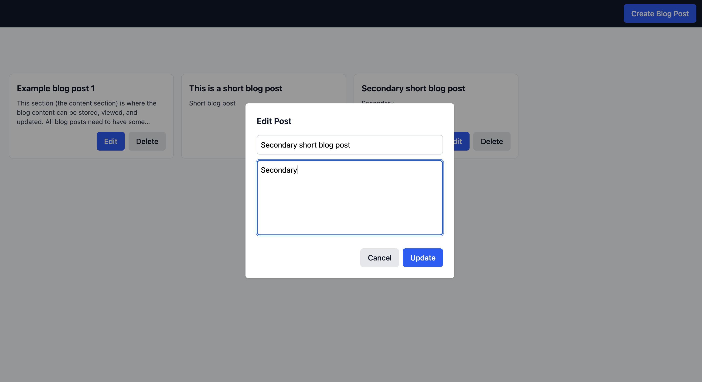
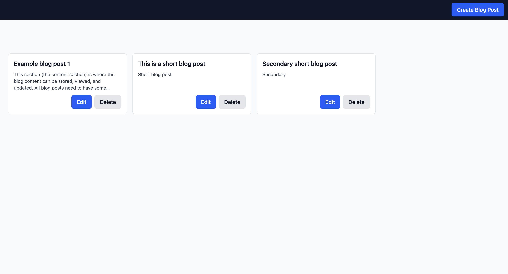
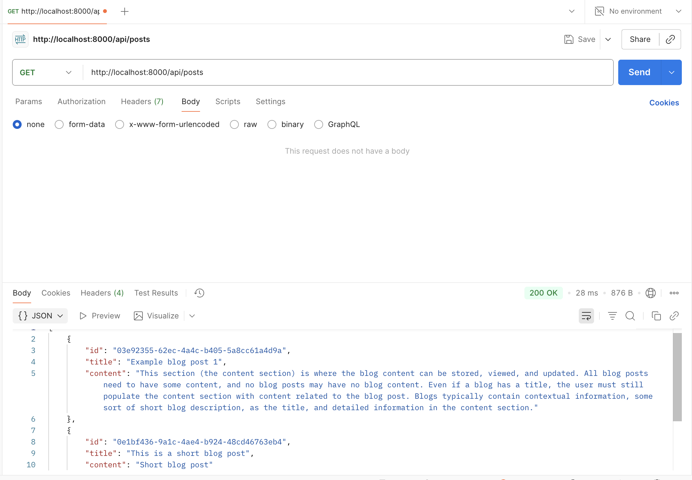
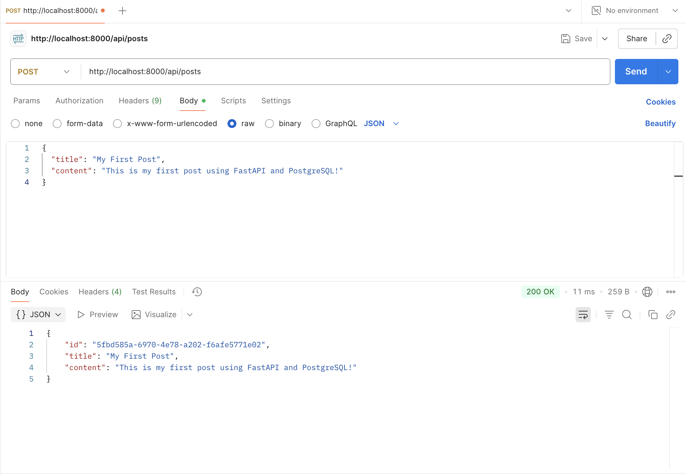

# SES-take-home

## Setup
1. Requirements: Node (18+), Docker + Docker compose
2. From /simple-blog-backend, run `docker compose up --build`
3. From /simple-blog-frontend, run `npm install` and `npm run dev`
4. Open the url that the frontend run specifies, and play around with the simple blog app!

## Design decisions
1. FastAPI: lightweight, fast bringup, highly readable code
2. PostgreSQL: More robust than SQL, stable, great for relational data. (I have familiarity with it as well)
3. SQLAlchemy: Defining models as python classes makes for great readability.
4. Docker compose/Docker: A great way to make database spin-up consistent for users, to limit the amount of spin-up work reviewers have to do.
5. React/Tailwind: Fast develpment time, in-line styling makes reading easier without jumping from file to file. 
6. Vite: Industry standard with built-in hot reloads for fast development.
7. React Query: Lots of capability right out of the box, less bug handling required than with manual queries.

## Screen captures

